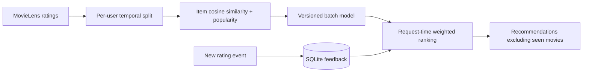

# Real-Time Recommendation System

A movie recommendation API that combines offline item similarity with persistent user feedback. A new rating updates the next recommendation request immediately; batch model retraining is not required for that user's updated profile.

**Stack:** Python 3.11+, pandas, NumPy, SciPy, scikit-learn, FastAPI, SQLite WAL, Docker, pytest, GitHub Actions.

## What is implemented

- MovieLens 100K data download with archive checksum validation; movie catalog and timestamped ratings.
- Item cosine similarity from positive user-item interactions, rating-weighted user profiles, and a popularity blend.
- Validation-selected blend weight; per-user chronological validation/test holdouts; full-catalog Recall@10, NDCG@10, and Precision@10 compared against popularity.
- Seen-item exclusion, popularity cold start, and readable ranking reasons.
- SQLite event upserts and persistence; feedback available on the next API request. This is request-time personalization, not Kafka streaming or online similarity retraining.
- Catalog search, validated ratings, optional API-key protection, browser demonstration, Docker setup, and CI.



## Run locally

```bash
git clone https://github.com/abiy8/real-time-recommender.git
cd real-time-recommender
python -m venv .venv
source .venv/bin/activate
# Windows PowerShell: .venv\Scripts\Activate.ps1
pip install -r requirements.txt
python download_data.py
python train.py
uvicorn app.main:app --reload
```

Open http://localhost:8000. Choose user ID 1000+ for a new user, search a movie, save a rating, and fetch recommendations again. Existing IDs 1–943 have offline training history. Open `/docs` for interactive API calls.

```bash
python -m pytest -q
cp .env.example .env
# Set a random API_KEY before sharing.
docker compose up --build
```

Compose downloads/trains first, then serves on localhost:8000 with persistent volumes. Dataset download needs internet; subsequent serving does not. Environment variables are `MODEL_PATH`, `EVENT_DB`, and `API_KEY`; Python commands do not automatically load `.env`.

## API examples

```bash
curl 'http://localhost:8000/catalog?q=Star%20Wars'
curl -X POST http://localhost:8000/events -H 'Content-Type: application/json' -d '{"user_id":1000,"item_id":50,"rating":5}'
curl http://localhost:8000/recommendations/1000
curl http://localhost:8000/evaluation
```

Add `X-API-Key` when configured. Ratings range from 1 to 5. Unknown movie IDs return 404. Rating an existing user/movie pair replaces that feedback rather than creating duplicate profile entries.

## Evaluation and tradeoffs

Measured results are in [`reports/evaluation.json`](reports/evaluation.json). Each user's last rating is test data and penultimate rating is validation. Only held-out ratings of at least 4 are relevant for the ranking benchmark. Candidate ranking uses the full catalog minus already-seen movies, not sampled negatives. Model selection uses validation only.

This split is temporal **within each user**: other users may contribute interactions later than a given user's test event. It is not a global chronological simulation. Offline metrics do not establish user satisfaction or business impact. Full pairwise similarity is practical for 1,682 movies but scales quadratically; larger catalogs need sparse top-k neighbors or approximate search. No ANN index, distributed event bus, online model retraining, A/B experiment, tenant authorization, or live cloud deployment is claimed.

## Data and licensing

[MovieLens 100K](https://grouplens.org/datasets/movielens/100k/) is provided by GroupLens. Data is downloaded separately and excluded from Git; read the downloaded dataset README before use, especially its restrictions on redistribution and commercial use. Cite F. M. Harper and J. A. Konstan, *The MovieLens Datasets: History and Context*, ACM TiiS (2015), [doi:10.1145/2827872](https://doi.org/10.1145/2827872). Original service code is MIT licensed; that license does not replace the dataset's terms.

### Recorded results (2 October 2026)

On 459 users whose held-out last rating was relevant: Recall@10 **6.97%** versus **5.66%** for popularity; NDCG@10 **0.0325** versus **0.0305**. The recall improvement is 1.31 percentage points (23.1% relative). Blend weight 0.9 was selected on validation. The absolute recall remains modest; the baseline and evaluation protocol are retained so the result can be assessed honestly.

Run `python benchmark.py` after training to reproduce sequential API timings. The recorded 100-request local TestClient run had p95 **1.59 ms**; this excludes an external network and does not establish concurrent production throughput.
